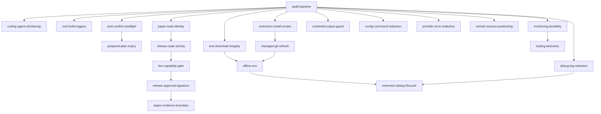

# Ti-trader 审计整改计划

## 1. 目标

本计划把 `docs/audit-report.md` 的 14 项发现拆成 21 个原子修复 PR。每个修复使用独立 `codex/fix/...` 分支，避免把交易安全、供应链、发布证据和文档变更混在一个大 PR 中。

修复原则：

- 每个分支只解决一个可验证问题。
- 每个分支从最新 `main` 创建；存在依赖时，等待前置 PR 合并后再创建，不长期堆叠。
- 不在多个分支重复修改同一生成文件或 lockfile。
- 交易安全变更必须先写失败测试，再改实现。
- 所有代码 PR 都运行定向测试与 `npm run check`。
- 不运行真实模型、交易所、OAuth、包发布或 Live pilot，除非维护者单独授权。
- 不提交 `.serena/`、真实 evidence、凭据、账户标识或原始认证响应。

## 2. 分支工作流

当前 `.gitignore`、审计报告和本计划先进入一个基线 PR：

```text
codex/fix/audit-baseline
```

该 PR 只包含：

- `.gitignore`
- `docs/audit-report.md`
- `docs/audit-remediation-plan.md`

基线合并后，每个修复按以下流程开始：

```bash
git switch main
git pull --ff-only
git switch -c codex/fix/<topic>
```

分支规则：

- 禁止从未合并的无关 fix 分支继续开发。
- 必须依赖前置修复时，在前置 PR 合并后从新 `main` 创建。
- 一个 PR 只使用一个 `fix(scope): ...` commit；确实需要拆分时，每个 commit 仍需可构建、可审查。
- 合并前用 `git diff main...HEAD` 确认没有夹带其他修复。
- 只 stage 当前分支修改的明确路径。

## 3. 合并顺序



可以并行的工作：

- `coding-agent-shrinkwrap`、`root-build-triggers`、`post-confirm-preflight`、`tool-download-integrity`、`extension-install-scripts`、`paper-soak-identity`、`monitoring-durability` 和四个秘密输出分支。
- `offline-env` 等供应链分支合并后再做，避免反复解决 `tools-manager.ts` 与 `package-manager.ts` 冲突。
- release gate 相关分支严格串行，避免同时修改 evidence schema 与同一组测试。
- `extension-dialog-lifecycle` 等 `debug-log-redaction` 与 `offline-env` 合并后再做，避免 `interactive-mode.ts` 冲突。

## 4. P0 修复：构建、发布与交易安全

### PR-01：恢复可验证的 coding-agent shrinkwrap

- 审计项：AUD-001
- 分支：`codex/fix/coding-agent-shrinkwrap`
- Commit：`fix(coding-agent): restore shrinkwrap generation`
- 主要文件：
  - `scripts/generate-coding-agent-shrinkwrap.mjs`
  - `packages/coding-agent/npm-shrinkwrap.json`
  - `package-lock.json`，仅在生成流程确实需要时修改
  - `package.json`，加入生成一致性检查
- 实现：
  1. 先查 Git 历史与上游对应版本，恢复成熟生成逻辑，不从零猜测 shrinkwrap 规则。
  2. 生成器使用 `npm install --package-lock-only --ignore-scripts` 或等价无生命周期脚本流程。
  3. 保留项目要求的 lifecycle-script allowlist 检查。
  4. 提供 `--check`，生成结果与仓库文件不一致时退出非零。
  5. 刷新 `chalk` 等漂移项，使 manifest、root lock 与 shrinkwrap 一致。
- 定向验证：
  - `node scripts/generate-coding-agent-shrinkwrap.mjs --check`
  - `npm run check`
- 完成标准：干净 checkout 重复生成零 diff；`prepublishOnly` 不再引用缺失脚本。

### PR-02：修正根 workspace 构建顺序

- 审计项：AUD-002
- 分支：`codex/fix/root-build-triggers`
- Commit：`fix(build): build triggers before trading agent`
- 主要文件：
  - `package.json`
  - 新增一个只验证 workspace build 顺序的根脚本测试
- 实现：
  1. 把 `packages/triggers` 放在 `packages/trading-agent` 前。
  2. 保持 `build` 与 `build:trading` 的依赖顺序一致。
  3. 用测试从 manifest 读取脚本，阻止后续再次遗漏直接 workspace 依赖。
- 定向验证：
  - `node --test scripts/<build-order-test>.test.mjs`
  - `npm run check`
  - 干净 full build 只在维护者明确授权后执行。
- 完成标准：删除 workspace `dist` 后，根 build 不依赖旧产物或外部同名包。

### PR-03：确认后重新执行市场与余额预检

- 审计项：AUD-003
- 分支：`codex/fix/post-confirm-preflight`
- Commit：`fix(engine): revalidate orders after confirmation`
- 主要文件：
  - `packages/trading-engine/src/engine.ts`
  - `packages/trading-engine/src/engine.test.ts`
- 实现：
  1. 保留确认前 preflight，使用户看到的订单先满足基本条件。
  2. 确认成功后、`journal.begin()` 前再次调用同一 preflight。
  3. 第二次失败必须 release prepared execution 与 reservation，绝不调用 adapter。
  4. 第二次预检只做市场元数据、余额、capability 和持仓约束复核，不静默改写订单数量。
  5. OCO 与普通订单走同一规则。
- 定向验证：
  - 从 `packages/trading-engine` 运行 `engine.test.ts`
  - 新增余额变化、market 失效、capability 变化、二次预检 I/O 失败和 release 失败用例
  - `npm run check`
- 完成标准：确认期间状态变化时无 adapter 调用；release 失败继续保留保守未知状态。

### PR-04：为 prepared plan 增加确认时效

- 审计项：AUD-003
- 分支：`codex/fix/prepared-plan-expiry`
- 前置：PR-03 合并
- Commit：`fix(engine): expire stale prepared plans`
- 主要文件：
  - `packages/trading-engine/src/engine.ts`
  - `packages/trading-engine/src/types.ts` 或 engine 私有 plan metadata
  - `packages/trading-engine/src/engine.test.ts`
  - 相关 trading-agent 配置与文案，仅当 TTL 可配置时修改
- 实现：
  1. 用本地 monotonic/注入 clock 记录 prepare 时间，不依赖交易所 ticker timestamp。
  2. 定义短而明确的默认 TTL；首版优先固定常量，避免增加没有必要的公共配置。
  3. confirmation 返回后超过 TTL，release reservation 并要求重新 prepare/confirm。
  4. 不自动重算后继续提交，避免用户确认的内容与实际订单不同。
- 定向验证：
  - 从 `packages/trading-engine` 运行 `engine.test.ts`
  - fake clock 覆盖 TTL 边界、确认取消、release 失败和 Paper unattended 快速路径
  - `npm run check`
- 完成标准：过期 plan 永不触达 adapter；错误明确要求重新准备订单。

## 5. P0 修复：供应链

### PR-05：固定并校验 fd/rg 下载工件

- 审计项：AUD-005
- 分支：`codex/fix/tool-download-integrity`
- Commit：`fix(coding-agent): verify managed tool downloads`
- 主要文件：
  - `packages/coding-agent/src/utils/tools-manager.ts`
  - `packages/coding-agent/test/tools-manager.test.ts`
- 实现：
  1. 不再查询不固定的 latest 作为执行来源。
  2. 为每个平台/架构固定版本、asset 名称和 SHA-256。
  3. 下载完成后先校验 digest，再解压和 chmod。
  4. digest 不匹配时删除 archive 和临时目录，且不覆盖已有可用 binary。
  5. 版本升级必须连同 digest 表和测试一起审查。
- 定向验证：
  - 从 `packages/coding-agent` 运行 `test/tools-manager.test.ts`
  - 覆盖 digest 成功、失败、截断下载和并发下载
  - `npm run check`
- 完成标准：没有 digest 的远端工件不能进入可执行路径。

### PR-06：默认禁止扩展依赖 lifecycle scripts

- 审计项：AUD-005
- 分支：`codex/fix/extension-install-scripts`
- Commit：`fix(coding-agent): disable package lifecycle scripts`
- 主要文件：
  - `packages/coding-agent/src/core/package-manager.ts`
  - `packages/coding-agent/test/package-manager.test.ts`
  - settings schema/selector，仅在引入显式 allowlist 时修改
- 实现：
  1. npm 与 Git dependency install 默认加入 `--ignore-scripts`。
  2. 需要 lifecycle script 的包只能通过显式、精确 package identity allowlist 开启。
  3. allowlist 不接受 glob，不继承到未信任 project scope。
  4. UI/CLI 在被拒时给出具体包名和修复入口，不自动 fallback 到有脚本安装。
- 决策门：这是对现有有意行为的收紧，实施前由维护者确认 allowlist 的存储位置和初始内容。
- 定向验证：
  - 从 `packages/coding-agent` 运行 `test/package-manager.test.ts` 与 `test/package-manager-ssh.test.ts`
  - `npm run check`
- 完成标准：默认安装路径不执行 lifecycle scripts；例外可审计且精确匹配。

### PR-07：约束 destructive Git refresh

- 审计项：AUD-005
- 分支：`codex/fix/managed-git-refresh`
- 前置：PR-06 合并
- Commit：`fix(coding-agent): guard managed git refresh`
- 主要文件：
  - `packages/coding-agent/src/core/package-manager.ts`
  - `packages/coding-agent/test/package-manager.test.ts`
  - `packages/coding-agent/test/git-update.test.ts`
- 实现：
  1. 只有位于 managed Git root 且具有 installer sentinel 的 checkout 才允许 `reset --hard`/`clean -fdx`。
  2. local path source 永不走 destructive refresh。
  3. 执行前记录将删除内容的摘要；消息不得包含 credential-bearing URL。
  4. sentinel 缺失或 realpath 越界时 fail fast，不尝试“修复”。
- 定向验证：
  - 运行 `test/package-manager.test.ts`、`test/git-update.test.ts`
  - `npm run check`
- 完成标准：任意用户目录或 local source 无法进入 destructive update 路径。

## 6. P0 修复：发布证据与 Live 准入

### PR-08：绑定 Paper soak 的采样与活动目录

- 审计项：AUD-007
- 分支：`codex/fix/paper-soak-identity`
- Commit：`fix(release): bind soak activity to data directory`
- 主要文件：
  - `scripts/trading-paper-soak.mjs`
  - `scripts/trading-paper-soak.test.mjs`
- 实现：
  1. 在导入 candidate 前，把 canonical `--data-dir` 写入 child/runtime 的 `TI_DATA_DIR`。
  2. 报告持久化 canonical data-dir identity hash，不记录绝对路径明文。
  3. activity 失败写入当前 sample，并令 `healthy=false`，除非该轮显式 `expectedFault`。
  4. 记录 activity attempts/successes/failures 和最后一次成功时间。
  5. 禁止复用 identity 不一致的旧 report。
- 定向验证：
  - `node --test scripts/trading-paper-soak.test.mjs`
  - `npm run check`
- 完成标准：activity 与 collector 不可能悄悄指向不同账户目录；失败不能产生健康样本。

### PR-09：要求 soak 包含真实活动

- 审计项：AUD-006
- 分支：`codex/fix/release-soak-activity`
- 前置：PR-08 合并
- Commit：`fix(release): require active paper soak evidence`
- 主要文件：
  - `scripts/trading-release-gate.mjs`
  - `scripts/trading-release-gate.test.mjs`
  - `docs/trading-release-evidence.md`
- 实现：
  1. gate 要求最小 activity success 数和 execution/order 观察数。
  2. 至少一个 controlled fault 和其后的健康恢复样本。
  3. 保持 duplicate/lost/unresolved 的原有约束。
  4. bump evidence schema，不兼容接受旧的空闲 soak。
- 定向验证：
  - `node --test scripts/trading-release-gate.test.mjs scripts/trading-paper-soak.test.mjs`
  - `npm run check`
- 完成标准：七天空闲报告无法通过；有活动但失败未恢复也无法通过。

### PR-10：把 Live capability 外部证据纳入 gate

- 审计项：AUD-004
- 分支：`codex/fix/live-capability-gate`
- 前置：PR-09 合并
- Commit：`fix(release): require verified live capabilities`
- 主要文件：
  - `scripts/trading-release-gate.mjs`
  - `scripts/trading-release-gate.test.mjs`
  - `docs/trading-release-evidence.md`
  - capability evidence schema/reader
- 实现：
  1. 新增 revision-bound `live-capabilities` artifact。
  2. artifact 必须列出 exchange、market family、position mode、order type、submit/query/cancel/recovery 结果、CCXT version 和 observation reference。
  3. pilot approval scope 必须是 artifact 中 externally verified 的子集。
  4. mock/offline-contract 证据不能满足该 artifact。
  5. 没有授权外部验证时保持 gate blocked，不生成成功占位。
- 定向验证：
  - `node --test scripts/trading-release-gate.test.mjs`
  - `npm run check`
- 完成标准：未外部验证的 venue/order 组合不能进入 pilot scope。

### PR-11：为 pilot approval 增加身份签名

- 审计项：AUD-006
- 分支：`codex/fix/release-approval-signature`
- 前置：PR-10 合并
- Commit：`fix(release): verify pilot approval signatures`
- 主要文件：
  - `scripts/trading-release-gate.mjs`
  - `scripts/trading-release-gate.test.mjs`
  - 审核者公钥配置
  - `docs/trading-release-evidence.md`
- 推荐设计：使用 Node `crypto` 原生 Ed25519 验证 canonical approval payload；仓库只保存审核者 ID 与公钥，不引入重型依赖。
- 决策门：维护者必须确认受信审核者、公钥轮换和撤销流程。
- 定向验证：
  - `node --test scripts/trading-release-gate.test.mjs`
  - 覆盖有效签名、未知 reviewer、篡改 payload、错误 revision、撤销 key
  - `npm run check`
- 完成标准：只有受信 reviewer 对精确 candidate/scope 的签名能满足 gate。

## 7. P1 修复：耐久性、秘密与网络边界

### PR-12：提升 monitoring state 的文件耐久性

- 审计项：AUD-008
- 分支：`codex/fix/monitoring-durability`
- Commit：`fix(trading-agent): durably persist monitoring state`
- 主要文件：
  - `packages/trading-agent/src/monitoring-state.ts`
  - `packages/trading-agent/src/state-durability.ts` 或复用 engine durable writer
  - `packages/trading-agent/src/__tests__/monitoring-state.test.ts`
  - `packages/trading-agent/src/__tests__/durable-trigger-monitor.test.ts`
- 实现：
  1. 使用 temp write、file fsync、rename 和 parent directory fsync。
  2. 保留同步 transaction 和文件锁语义。
  3. 不声称 exactly-once delivery；稳定 event ID 与 at-least-once 语义继续保留。
  4. 增加 write/rename/fsync 故障注入与重启恢复测试。
- 定向验证：
  - 从 `packages/trading-agent` 运行上述两个测试
  - `npm run check`
- 完成标准：每个持久边界失败都不发布未落盘状态；重复通知仍不会成为交易授权。

### PR-13：保护明文 credential 输出

- 审计项：AUD-009
- 分支：`codex/fix/credential-output-guard`
- Commit：`fix(coding-agent): guard credential output`
- 主要文件：
  - `packages/coding-agent/src/main.ts`
  - `packages/coding-agent/src/cli/credential-print.ts`
  - `packages/coding-agent/src/args.ts`
  - `packages/coding-agent/test/credential-print.test.ts`
  - `packages/coding-agent/test/stdout-cleanliness.test.ts`
- 推荐行为：默认拒绝向 TTY 打印秘密；保留显式 raw flag 供脚本使用，并提供 mode-600 文件输出。
- 决策门：这是对有意明文输出功能的收紧，实施前确认 CLI 兼容策略；不保留隐式 fallback。
- 定向验证：运行 credential 与 stdout 两份测试，随后 `npm run check`。
- 完成标准：交互误用不会把 token 打到终端；机器模式 stdout 仍保持协议洁净。

### PR-14：脱敏并收紧 debug log

- 审计项：AUD-009
- 分支：`codex/fix/debug-log-redaction`
- Commit：`fix(coding-agent): redact interactive debug logs`
- 主要文件：
  - `packages/coding-agent/src/modes/interactive/interactive-mode.ts`
  - 新增独立 redaction helper
  - 对应 interactive test
- 实现：
  1. 只记录诊断元数据和经过脱敏的消息摘要，不直接 dump 全部消息对象。
  2. 覆盖 Authorization、API key、bearer token、credential config 和常见 secret query 参数。
  3. 以 0600 原子创建日志。
  4. UI 明确提示该文件仍可能包含用户内容。
- 定向验证：运行新增 debug-log 测试与 `interactive-tui.test.ts`，随后 `npm run check`。
- 完成标准：已知 secret fixtures 不出现在日志字节中；日志权限正确。

### PR-15：隐藏配置命令中的秘密

- 审计项：AUD-009
- 分支：`codex/fix/config-command-redaction`
- Commit：`fix(coding-agent): redact config command failures`
- 主要文件：
  - `packages/coding-agent/src/core/resolve-config-value.ts`
  - `packages/coding-agent/test/resolve-config-value.test.ts`
- 实现：错误只报告配置位置、exit code 和安全分类，不回显完整命令、环境或 stdout/stderr。命令执行能力本身不在此 PR 删除。
- 定向验证：运行 `resolve-config-value.test.ts`，随后 `npm run check`。
- 完成标准：secret 参数和 command stdout/stderr 不进入错误文本。

### PR-16：统一 provider 错误脱敏

- 审计项：AUD-009
- 分支：`codex/fix/provider-error-redaction`
- Commit：`fix(ai): redact provider error bodies`
- 主要文件：
  - `packages/ai/src` 中共享错误规范化 helper
  - 各 adapter 只调用共享 helper，不各自复制 regex
  - `packages/ai/test/error-body.test.ts`
  - `provider-error-body-passthrough.test.ts`
  - `provider-error-body-regression.test.ts`
- 实现：
  1. 在长度截断前对 header-like、JSON key、URL query 和 bearer token 做结构化脱敏。
  2. 保留 provider error code、status 和非秘密诊断。
  3. 不修改 abort/retry 分类。
- 定向验证：运行三份 error-body 测试和相关 provider regression，随后 `npm run check`。
- 完成标准：credential fixture 不出现在异常 message、cause、raw diagnostic 或 telemetry attributes。

### PR-17：统一 `PI_OFFLINE` 解析

- 审计项：AUD-010
- 分支：`codex/fix/offline-env`
- 前置：PR-05、PR-07 合并
- Commit：`fix(coding-agent): unify offline mode parsing`
- 主要文件：
  - 新增 `packages/coding-agent/src/utils/offline.ts`
  - `tools-manager.ts`
  - `package-manager.ts`
  - `version-check.ts`
  - `interactive-mode.ts`
  - 对应 tests
- 规则：unset/`0`/`false`/`no` 为 online；`1`/`true`/`yes` 为 offline；其他非空值 fail closed 并产生一次诊断。
- 定向验证：运行 `version-check.test.ts`、`tools-manager.test.ts`、`package-manager.test.ts` 与新增 helper 测试，随后 `npm run check`。
- 完成标准：同一值对所有管理网络入口产生一致行为。

### PR-18：修复 extension dialog 生命周期

- 审计项：AUD-011
- 分支：`codex/fix/extension-dialog-lifecycle`
- 前置：PR-14、PR-17 合并
- Commit：`fix(coding-agent): settle replaced extension dialogs`
- 主要文件：
  - `packages/coding-agent/src/modes/interactive/interactive-mode.ts`
  - 新增 extension UI lifecycle tests
- 实现：
  1. 用单一 active dialog record 保存 token、dispose 和 settle。
  2. 打开新 dialog 前以 `undefined` settle 旧 dialog。
  3. abort callback 只关闭 token 相同的 dialog。
  4. selector/input/custom 都使用同一生命周期函数。
- 定向验证：覆盖并发、替换、旧 signal abort、timeout、shutdown 和 reload；运行相关 interactive tests 与 `npm run check`。
- 完成标准：所有 Promise 有且只有一次 settlement，旧事件不能关闭新 UI。

## 8. P1/P2 修复：证据边界与可观测性

### PR-19：编码 Paper 证据边界

- 审计项：AUD-012
- 分支：`codex/fix/paper-evidence-boundary`
- 前置：PR-11 合并
- Commit：`fix(release): label paper simulation evidence`
- 主要文件：
  - Paper soak/report schema
  - release gate 与测试
  - trading README、operations、release evidence 文档
- 实现：
  1. Paper evidence 显式包含 simulation model/version 和 `notLiveExecutionEvidence: true`。
  2. gate 忽略任何 Paper profitability 字段，不把 PnL 当 Live 准入条件。
  3. CLI/报告固定披露无滑点、部分成交、funding 和 venue liquidation 语义。
- 定向验证：运行 soak/gate 测试和 `npm run check`。
- 完成标准：代码、报告和文档都无法把 Paper 收益解释成 Live 支持证据。

### PR-20：接入最小交易 telemetry

- 审计项：AUD-013
- 分支：`codex/fix/trading-telemetry`
- 前置：PR-12 合并
- Commit：`fix(trading-agent): emit trading lifecycle telemetry`
- 主要文件：
  - trading-agent runtime/monitor/recovery 边界
  - telemetry schema 与测试
- 范围：只增加可注入、默认 NOOP 的 span；不在此 PR 引入 exporter 或网络后端。
- Span：runtime init/replacement、execution recovery、monitor poll/delivery。属性只包含 mode、market family、安全错误分类、计数和时长；禁止 symbol/account ID、prompt、order payload、credential 和原始错误 body。
- 定向验证：使用 InMemoryTelemetryContext 验证 parent/child、成功/失败/abort 和敏感字段缺失，随后 `npm run check`。
- 完成标准：关键生命周期可测试地发 span；未配置 telemetry 时无行为变化和网络副作用。

### PR-21：明确 RemoteSession 的非产品定位

- 审计项：AUD-014
- 分支：`codex/fix/remote-session-positioning`
- Commit：`fix(docs): clarify remote session availability`
- 主要文件：
  - root/trading-agent README
  - protocol/client/coding-agent 相关 README 或导出注释
- 实现：明确 CBOR protocol、client 与 RemoteSession 是库/experimental 能力；Ti 当前没有生产 CBOR server 装配，JSONL RPC 是另一条链。列出未来启用前必须审计的认证、授权、租约、TLS 和交易工具权限。
- 验证：链接检查、`git diff --check`；无代码测试。
- 完成标准：任何公开文档都不暗示 Ti 已提供远程交易服务。

## 9. PR 模板

每个 PR 描述保持同一结构：

```markdown
## Problem
<对应 AUD 编号与具体失败路径>

## Change
<只描述本分支的行为变化>

## Invariants
- unknown submission is never retried
- no credential or authenticated payload is persisted
- Paper behavior is not presented as Live evidence

## Verification
- <定向测试>
- npm run check

## Out of scope
<明确列出相邻但未包含的修复分支>
```

风险较高的 PR 必须在描述中加入一条具体 trace，例如：

```text
prepare -> reserve -> user confirms slowly -> second preflight fails -> release -> no adapter call
```

## 10. 完成定义

单个修复完成必须同时满足：

1. 对应失败测试先能复现旧行为。
2. 实现删除根因，不增加 fallback 或静默兼容路径。
3. 定向测试通过。
4. `npm run check` 无 error、warning 或 info。
5. PR diff 只包含该修复和必要测试/文档。
6. 审计报告中的验收标准可逐条对应到测试或外部 evidence。
7. 没有测试、build 或外部验证时必须明确写“未验证”，不能用静态阅读替代。

整个整改完成还需要：

- P0 分支全部合并。
- 干净 candidate 的 `npm run check`、`./test.sh`、构建和仓库外安装验证。
- 九项 recovery drills。
- 修复后重新开始的七天 activity Paper soak。
- revision-bound、签名审批和 externally verified Live capability evidence。
- 最终仅批准禁 withdrawals、逐单确认、极低 notional 的有限 pilot；无人值守仍是独立项目。
