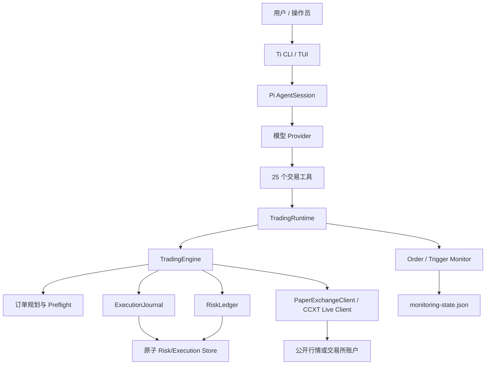

# Ti-trader 完整静态审计报告

## 1. 审计结论

审计对象是提交 `c678c130cf864c62c45449856a3f92f9a41c90ec`（`main`）对应的 Ti-trader 工作树。

总体判断：核心交易状态机设计质量较高，但当前候选不具备“生产可用”或“无人值守实盘”结论所需的工程证据。系统可以继续用于隔离 Paper 验证；在完成高优先级整改、真实发布链验证、恢复演练和受限 Live 证据前，不应进入真实资金试点。

最重要的架构事实是：这不是“让 LLM 直接操作交易所”。LLM 只驱动受限交易工具；订单规划、风险预留、提交资格、未知结果处理和恢复由确定性的 `trading-engine`、`trading-risk` 与 execution journal 强制执行。超时或网络错误不会被当成“订单不存在”，未知提交不会自动重发。

本次发现：

| 等级 | 数量 | 含义 |
| --- | ---: | --- |
| 严重 | 0 | 未发现可直接绕过交易内核并重复下单的确定性路径 |
| 高 | 5 | 发布、构建、Live 准入或资金安全相关阻断项 |
| 中 | 7 | 运维、供应链、证据质量或耐久性缺口 |
| 低 | 2 | 可观测性和实验性功能完整度问题 |

当前发布判断：

- Paper 开发验证：可以继续，但必须使用独立数据目录，并明确 Paper 行情可能联网。
- 人工逐单确认的 Live pilot：不批准。缺少外部交易所证据和已验证安装工件。
- 无人值守 Live：不批准。项目当前产品目标本身也不是无人值守服务。
- npm 发布：不批准。`coding-agent` 发布链与 shrinkwrap 当前不一致。

## 2. 范围与方法

### 2.1 覆盖范围

审计覆盖 11 个 workspace 包及仓库级脚本、配置、文档、扩展和测试：

- Agent 基础设施：`packages/ai`、`packages/agent`、`packages/coding-agent`、`packages/tui`、`packages/protocol`、`packages/client`、`packages/telemetry`。
- 交易条件层：`packages/triggers`。
- 交易核心：`packages/trading-risk`、`packages/trading-engine`。
- 产品装配：`packages/trading-agent`。
- 仓库级：`scripts/`、`.github/`、根构建配置、发布与运维文档、bundled extensions 和 examples。

### 2.2 方法

- 使用 Serena 进行符号级源码读取、引用核对和架构归纳。
- 对长文件按符号或连续小块补齐，目录 overview、测试标题和截断输出不计作全文证据。
- 对两个大型 JSONL fixture 使用 `jq` 逐条解析全部记录，核对 JSON 有效性、消息类型、工具调用配对、压缩和终止状态。
- 对生成的单行 Emscripten 产物只核对接口、导出与实际消费面，不把生成代码当作人工维护逻辑逐字符审查。
- 将结论持续写入 Serena Memory，最终架构摘要位于 `architecture/system_overview_and_assessment`。

### 2.3 未执行事项

本次是静态审计，没有执行：

- `npm run check`、`./test.sh`、build、pack 或 install。
- CLI、TUI、RPC server、模型请求、OAuth、交易所 API、SSH、VM 或 sandbox。
- Paper smoke、恢复演练或 Live/testnet pilot。
- 真实凭据读取、刷新或外部 provider 认证。

因此，本报告证明的是“当前代码表达了什么行为和约束”，不是“测试当前通过”“交易所实际接受”“策略盈利”或“生产可用”的证明。

## 3. 系统架构

### 3.1 Agent 边界

启动链是：

`ti -> cli.ts -> main.ts -> initTrading() -> createAgentSessionServices() -> AgentSession -> InteractiveMode/runPrintMode`

Ti 创建会话时使用 `noTools: "builtin"`，不向模型暴露 coding-agent 的 read、bash、edit、write、grep、find、ls。模型只能看到交易工具和明确启用的研究扩展。交易所凭据由 Ti 数据目录管理，模型凭据由 Pi 的 `ModelRuntime/AuthStorage` 管理，两者不是同一存储链。

### 3.2 交易提交链

真实订单路径如下：

1. 模型或用户读取行情、账户、能力和风险状态。
2. `check_order` 可预览规划结果，但不产生后续提交必须持有的授权令牌。
3. `prepareOrder/prepareOcoOrder` 校验市场家族、订单类型、数量、合约单位、方向与 capability，生成冻结且绑定当前 engine 的 plan。
4. `submitWithReservation` 重新执行 market/balance preflight。
5. Execution journal 与 RiskLedger 在一个原子事务中写入 prepared execution、execution block、quota reservation 和 audit。
6. Live 进入人工确认；拒绝时释放 reservation。
7. 确认后重新检查 abort、pause、maintenance 与 admission generation，随后把 execution 推进到 submission-started。
8. plan 在真正调用 adapter 前被消费，禁止并发调用或重试导致重复提交。
9. 明确拒绝释放 quota；成功响应经过 execution evidence 校验；超时、网络错误或相关性不足保留 unknown 和 quota claim。
10. 重启恢复只按稳定 client ID/list ID 查询，不重新 place。

主要实现证据：

- `packages/trading-engine/src/engine.ts:358`，`TradingEngine.submitWithReservation`。
- `packages/trading-engine/src/execution-journal.ts:554`，`ExecutionJournal.prepare`。
- `packages/trading-engine/src/execution-journal.ts:586`，`ExecutionJournal.begin`。
- `packages/trading-engine/src/execution-journal.ts:625`，`ExecutionJournal.settle`。
- `packages/trading-risk/src/risk.ts:609`，`RiskLedger.reserve`。

### 3.3 风控与恢复

- Paper 与 Live 有独立 usage，但未决 execution block 会阻止共享 store 上的新敞口，不能通过切模式绕过未知提交。
- Live 每日额度按 UTC 日期滚动；Paper 额度只有显式 reset 才清零。
- pause 阻止新增敞口，但保留经验证的退出、保护单和撤单能力。
- runtime replacement、账户切换和 Paper reset 使用 durable maintenance generation；旧 runtime 和旧 plan 在 generation 推进后失效。
- manual resolve 需要匹配原 scope、expected revision 和 terminal evidence reference，不能只凭时间、价格和数量猜测订单身份。

### 3.4 Paper 与 Live

Paper 使用公开行情和本地账本，不向交易所发送订单，但不是完全离线。它实现了资金预留、期货 FIFO lots、简化强平、条件单、trailing、spot OCO、K 线路径回填和双账户 redo journal。

Paper 不模拟完整交易所语义：没有真实滑点、部分成交、funding、交易所特定强平阶梯或撮合队列。因此 Paper 可以证明工作流与恢复路径，不能证明策略收益、Live 成交质量或交易所兼容性。

Live 通过 CCXT 接入 spot 与 linear USDM futures。Binance 的 client ID、algo order、OCO、hedge/reduceOnly 和 filter 处理最完整；其他 venue 仍有 experimental/unknown 能力。

### 3.5 监控与研究

- Order monitor 跟踪 open/history/positions，通知 outbox 是 at-least-once，而不是 exactly-once。
- Trigger evaluator 使用受限三值 AST；缺失、过期、未来或非有限事实为 unknown。
- Live trigger 不自动唤醒交易回合，但 order monitor 的近期 fill/guard 仍可按配置 wake；后续交易仍经过确认和风控。
- Market-lab 丢弃未闭 K 线，只输出指标、事件和失效候选；`simulate_rule` 不是完整 backtest。
- Web、Zhihu、Freqtrade 和 market-research 使用 host/path/env/tool allowlist，外部内容标记为 untrusted，不获得订单执行权限。

## 4. 正向控制

以下设计应保留：

1. 未知提交不自动重发。网络失败默认保守保留 execution 与 reservation。
2. 风控 reservation 与 execution journal 共用原子 store，不依赖两个独立成功写入拼接一致性。
3. 提交前生成稳定 client ID，恢复只做相关查询，不按相似金额或时间猜测。
4. prepared plan 冻结并绑定 engine，跨 runtime 或伪造 plan 无法提交。
5. pause、maintenance generation 和 execution block 在模型提示词之外强制执行。
6. 交易模型看不到 coding tools，市场读取 view 不暴露 place/cancel。
7. Paper/Live、模型/交易凭据、研究/执行的边界清楚。
8. 风险、execution 和 Paper 账户使用文件锁、临时文件、rename 和 fsync；损坏状态 fail closed。
9. capability 区分 supported、unsupported、unknown，不把 unknown 自动提升为支持。
10. 发布 evidence 绑定 candidate revision、artifact hash、版本和 clean checkout，且明确不把 passing gate 等同于无人值守批准。

## 5. 详细发现

### AUD-001：coding-agent 发布链当前不可重现

- 等级：高
- 状态：开放
- 类型：发布阻断

证据：

- `packages/coding-agent/package.json:43` 把 shrinkwrap 命令指向 `scripts/generate-coding-agent-shrinkwrap.mjs`。
- 根 `scripts/` 中不存在该文件，`prepublishOnly` 因此会在 shrinkwrap 阶段失败。
- `packages/coding-agent/package.json:53` 使用 `chalk 6.0.0`。
- `packages/coding-agent/npm-shrinkwrap.json:18` 和 `:1038` 仍固定 `chalk 5.6.2`。

影响：

- 当前 package manifest 与发布闭包不一致。
- 发布可能直接失败，也可能在绕过正常脚本时生成与审查内容不同的安装结果。

建议：

1. 恢复或重写 shrinkwrap 生成脚本。
2. 使用 `npm install --package-lock-only --ignore-scripts` 和仓库指定生成流程刷新 closure。
3. 增加 `--check` 模式，并纳入 `npm run check` 与 CI。
4. 在修复前禁止发布 coding-agent 或任何依赖其现状的聚合工件。

验收标准：干净 checkout 上 `prepublishOnly` 成功；重复生成无 diff；manifest、root lock、shrinkwrap 的直接依赖版本一致。

### AUD-002：根 full build 的依赖顺序不完整

- 等级：高
- 状态：开放
- 类型：构建正确性

证据：

- 根 `package.json:14` 的 `build` 没有构建 `packages/triggers`。
- `package.json:15` 的 `build:trading` 才显式先构建 triggers。
- `packages/trading-agent/package.json:55` 直接依赖 `@nikopack/ti-triggers`。
- `packages/trading-agent/src/monitoring-state.ts:9` 与 `trigger-monitor.ts:10` 直接 import 该包。

影响：干净环境的 full build 可能依赖旧 `dist`、已安装发布包或偶然残留，构建结果不可自证。

建议：把 workspace build 改为显式依赖图或使用能按 workspace dependency 排序的构建器；至少在根 `build` 中把 triggers 放在 trading-agent 前。

验收标准：删除全部 workspace `dist` 后，根 `npm run build` 在干净安装中一次通过，且不读取仓库外同名包。

### AUD-003：人工确认后没有重新验证行情与余额

- 等级：高
- 状态：已修复（TTL、确认后预检、实质变化重新确认）
- 类型：资金安全

证据：`packages/trading-engine/src/engine.ts:358-486`。

`submitWithReservation` 在 confirmation 前执行 preflight。confirmation 返回后只重新检查 AbortSignal、entry pause 和 journal admission，然后调用 adapter。它不会重新获取 ticker、balance、market metadata，也没有检查 plan 的 reference timestamp 是否过期。

影响：用户长时间阅读确认内容时，价格、余额、最小名义额、仓位或交易所元数据可能已经变化。最终 adapter 仍可能拒绝，但系统不能保证确认时展示的证据仍然有效。

建议：

1. 为 prepared plan 增加明确 TTL。
2. confirmation 后重新执行 preflight。
3. 若价格、数量、风险 notional 或 warning 有实质变化，生成新 summary 并要求重新确认，而不是静默继续。
4. 把 adapter 最终校验保留为最后防线，不用它替代本地重新确认。

验收标准：测试覆盖确认期间价格、余额、市场规则和 position 变化；过期或变化的 plan 不发送，且 reservation 被可靠释放。

整改：TTL 与确认后预检已落地。确认绑定最新证据快照；价格、风险 notional 或 warning 实质变化会生成新 summary 并再次确认。会改变冻结订单数量的仓位变化、触发价失效和无人值守 1% 漂移仍 fail-closed。

### AUD-004：Live 能力缺少外部交易所验证

- 等级：高
- 状态：开放，属于发布证据缺口
- 类型：Live 准入

当前 capability evidence 主要是 offline-contract 和 mock adapter 测试。Binance 覆盖最好，但仍不能据此证明 testnet/live 的真实 endpoint、权限、client ID 查询、algo order、OCO、hedge、错误分类和恢复语义。OKX/Bybit 更明确属于 experimental/unknown。

影响：离线 contract 可能与交易所版本、账户模式、地区、权限或 CCXT 行为漂移不一致。

建议：

1. 先只选择一个受限 Binance spot 路径和一个 USD-M 路径。
2. 在专用 testnet 或极小真实资金账户中验证 submit/query/cancel/recovery 全链。
3. 禁用 withdrawals，固定逐单确认和 notional cap。
4. 把 evidence 绑定 revision、exchange、account mode、CCXT version 和原始非秘密观察记录。
5. 未验证组合继续保持 unknown/experimental，不扩大文案。

验收标准：每个宣称 supported 的 Live 组合都有可复核外部证据，而不是只有 mock 测试。

### AUD-005：自动下载与扩展安装扩大供应链执行面

- 等级：高
- 状态：开放
- 类型：供应链

证据：

- `packages/coding-agent/src/utils/tools-manager.ts:124` 直接保存远端响应。
- `tools-manager.ts:241` 从 GitHub latest release 下载 fd/rg、解压并设为可执行，没有 digest 或签名校验。
- `packages/coding-agent/src/core/package-manager.ts:1777` 的 Git dependency install 没有默认加入 `--ignore-scripts`。
- `package-manager.ts:1920` 会对受管 Git checkout 执行 `git clean -fdx`，随后安装依赖。

Ti 禁用了模型可调用的 coding tools，但 package/extension 管理和宿主启动仍可能触达这些代码，所以不能把它视为完全无关的上游功能。

影响：远端 release、registry、Git 仓库或传输链被污染时，可执行文件或 npm lifecycle script 可以在本机运行。受管 Git 目录中的本地修改也会被 destructive refresh 删除。

建议：

1. 固定工具版本并验证 SHA-256；优先使用平台包管理器或受信制品仓库。
2. npm/Git dependency install 默认 `--ignore-scripts`。
3. 必须运行 lifecycle script 的依赖使用显式 allowlist 和审查记录。
4. destructive Git refresh 仅用于明确标记的缓存目录，并在 UI 中明确告知。

验收标准：网络下载均有固定版本和 digest；默认安装不会执行 lifecycle script；供应链策略有自动测试。

### AUD-006：release gate 不证明 soak 有交易活动或审批真实性

- 等级：中
- 状态：开放
- 类型：证据质量

证据：`scripts/trading-release-gate.mjs:52-170`。

gate 检查七天时长、采样间隔、restart、duplicate/lost/unresolved 和最终健康，但不要求任何 order、execution 或 activity 计数。连续七天的空闲样本可以满足 soak 结构。`pilotApproval` 只是 JSON 字段，artifact hash 保护文件一致性，但不认证 reviewer 身份。

影响：gate 可以证明 evidence 自洽，不能证明系统实际经历过成交/恢复负载，也不能证明审批来自授权维护者。

建议：

1. soak 增加最低 activity、execution 和 controlled-fault 计数。
2. 区分“观察 soak”和“活动 soak”，两者都必须满足。
3. 使用签名 commit、GitHub review、Sigstore 或组织内部签名对 approval 建立 provenance。
4. gate 输出中明确显示 evidence assurance level。

验收标准：没有实际活动的 soak 无法满足 pilot gate；审批可以追溯到授权身份。

### AUD-007：Paper soak 的采样目录与活动目录可能分离

- 等级：中
- 状态：开放
- 类型：验证工具

证据：

- `scripts/trading-paper-soak.mjs:258` 从 `--data-dir` 指向的目录采样。
- `:265` 只导入已安装包的 `initTrading`。
- `:167` 调用 `initTrading({ mode: "paper" })`，没有传递采样目录。
- `:286` 中 activity 失败只写 stderr，下一轮样本不会自动标记为 unhealthy。

如果进程环境中的 `TI_DATA_DIR` 与 `--data-dir` 不一致，脚本可能在一个账户做 activity，却采样另一个账户。

建议：

1. 在导入 candidate 前强制设置并核验 `TI_DATA_DIR === realpath(--data-dir)`。
2. 在报告中记录 activity success/failure、订单数和最后一次成功时间。
3. activity 失败必须影响 sample health，除非显式标记 expected fault。
4. gate 校验 activity 目录 identity 与 collector identity 一致。

验收标准：测试覆盖环境目录不一致、activity 网络失败和安装包导入失败；错误不能产生健康证据。

### AUD-008：monitoring state 的耐久等级低于交易核心状态

- 等级：中
- 状态：开放或需明确接受
- 类型：持久化与通知

证据：`packages/trading-agent/src/monitoring-state.ts:403-424`。

monitoring store 使用文件锁和 `writeJsonFile`，但没有使用 risk/execution/Paper 的 durable fsync writer。通知 delivery 是 at-least-once：send 成功、ack 持久化前崩溃会重投同一 event ID。

影响：断电边界可能丢失最近 monitoring 状态；重启可能重复通知。核心交易 journal 不受此问题影响，但 release/operations 文案不能把两者描述为同等级耐久。

建议：

1. 若 monitoring 是 release evidence 的组成部分，改用 durable file+directory fsync。
2. 下游通知按稳定 event ID 去重。
3. UI 和 runbook 明确 at-least-once 语义。
4. 增加 send-success/ack-failure 的故障注入测试。

验收标准：断电恢复测试明确记录可接受的数据损失窗口；重复 delivery 不产生重复交易授权。

### AUD-009：存在多个有意或间接的秘密输出面

- 等级：中
- 状态：开放，部分为有意功能
- 类型：秘密管理

证据：

- `packages/coding-agent/src/main.ts:169` 把解析后的 credential 明文写到 stdout。
- `packages/coding-agent/src/modes/interactive/interactive-mode.ts:6513-6537` 把完整渲染内容和 agent messages 写入 debug log。
- `packages/coding-agent/src/core/resolve-config-value.ts:220` 允许 `!command` 配置执行本地 shell 并读取 stdout。
- 多个 provider adapter 会把受限长度的原始错误 body 或 SSE 数据带入错误对象；没有全局自动脱敏层。

影响：shell history、CI log、debug 文件、错误日志或支持材料可能泄露 token、prompt、工具输出和账户信息。

建议：

1. credential-print 要求显式危险确认，拒绝 TTY 误用，并提供仅写入指定 mode-600 文件的模式。
2. debug log 默认做字段级脱敏并以 0600 创建；显示明确敏感警告。
3. 配置 command 的 stderr/stdout 错误不要回显完整命令和秘密参数。
4. provider error 统一经过可测试的 redaction policy。

验收标准：token、Authorization、API key 和已知 credential fixture 不出现在普通日志、debug 文件和错误消息中。

### AUD-010：offline 开关语义不一致

- 等级：中
- 状态：开放
- 类型：网络边界

证据：

- `packages/coding-agent/src/utils/tools-manager.ts:13` 和 package manager 只把 `1/true/yes` 视为 offline。
- `packages/coding-agent/src/utils/version-check.ts:55` 把任何非空 `PI_OFFLINE` 都视为 offline。
- `InteractiveMode.run` 同样使用 `!process.env.PI_OFFLINE` 判断模型目录刷新。

例如 `PI_OFFLINE=enabled` 会阻止部分网络请求，但仍可能允许工具下载或包更新。

建议：建立唯一 `parseOfflineEnv()`，所有网络入口只调用该函数；测试空值、`0/false/no`、`1/true/yes` 和非法值。更稳妥的规则是非法非空值 fail closed。

验收标准：同一环境值对模型目录、版本检查、工具下载、包管理和 HTTP 管理请求产生一致结果。

### AUD-011：扩展对话框并发时可能悬挂旧 Promise

- 等级：中
- 状态：开放
- 类型：交互可靠性

证据：

- `packages/coding-agent/src/modes/interactive/interactive-mode.ts:2553` 和 `:2629` 每次打开 selector/input 都覆盖单例字段。
- `:4571` 的 `disposeActiveSelector` 只调用当前注册的 dispose，不保证解决被覆盖对话框的 Promise。

并发扩展调用可能使旧 Promise 永不 settle；旧 AbortSignal 也可能关闭后来打开的新 UI。

影响：TUI 扩展命令可永久等待，阻塞 reload、shutdown 或后续用户操作。交易内核不被绕过，但操作员可用性下降。

建议：序列化 extension dialog；每个 dialog 使用 token 和独立 resolver；替换时必须以 `undefined` settle 旧 Promise，abort 只能关闭相同 token。

验收标准：并发 selector/input/custom、先 abort 后替换、替换后旧 abort 等回归均能确定结束。

### AUD-012：Paper 模型不能作为收益或 Live 成交证据

- 等级：中
- 状态：设计限制，必须持续披露
- 类型：模型风险

Paper 市价单按 ticker 全额成交，条件单通过 OHLCV path 惰性撮合；没有真实滑点、部分成交、funding、队列优先级和 venue-specific liquidation tier。强平与保证金也是近似模型。

影响：Paper PnL 会系统性高估部分策略，尤其是低流动性、频繁交易、条件单和高杠杆策略。

建议：

1. 所有 Paper 报告固定显示模拟缺口。
2. release gate 不接受 Paper 收益作为 Live 风险结论。
3. 如需策略评估，接入成熟 backtest/execution simulator，并使用真实手续费、滑点和 funding 数据。

验收标准：产品文案、报告和 UI 不出现“Paper 盈利证明 Live 可用”的表述。

### AUD-013：Telemetry 目前主要是契约，不是生产可观测性

- 等级：低
- 状态：开放
- 类型：可观测性

`packages/telemetry` 提供 schema、NOOP 和内存实现；生产源码中没有找到 `startAiSpan/startHarnessSpan` 的实际调用链，也没有 exporter、全局 context、持久化或后端。

影响：provider、agent turn、tool、recovery 和关键延迟无法依赖统一 telemetry 追踪。现有日志与 durable audit 只能覆盖部分问题。

建议：先为 execution/recovery/monitor 增加不含秘密的结构化 span，再接入显式配置的 exporter；敏感和高基数字段必须有独立数据政策。

### AUD-014：RemoteSession/CBOR 不是当前 Ti 的生产服务链

- 等级：低
- 状态：信息性
- 类型：功能完整度

protocol/client/RemoteSession 有完整库和测试，但 Ti 的生产入口没有装配相应 CBOR server；当前 JSONL RPC 是另一条链。不能把这些 package 的存在描述为 Ti 已提供远程交易服务。

建议：在产品文档中保持 experimental/internal 定位。若未来启用，需单独审计认证、租约、权限、传输加密和远程工具授权。

## 6. 测试与证据评估

### 6.1 静态可见覆盖

测试源码覆盖以下关键不变量：

- RiskLedger：reservation exactly-once、原子 store、pause、额度滚动、坏状态 fail closed。
- Execution：prepare/begin/settle、unknown submit、并发 recovery、maintenance generation、manual resolve。
- Paper：spot/futures、FIFO、强平、条件单、OCO、K 线回填、持久事务与 fsync 故障注入。
- Live adapter：Binance spot/futures、client ID、algo endpoint、OCO、contract conversion、错误分类。
- Runtime：配置串行化、账户切换、Paper reset、旧 engine retire、恢复先于发布。
- Monitoring/Triggers：三值条件、stable_for、outbox、lease、重启和双 monitor 去重。
- Agent/Session：tool call/result 顺序、compaction、retry、runtime replacement、TUI/RPC/JSON 输出。
- AI providers：流事件、thinking、tool calls、usage、retry、消息 replay、多模态和 OAuth。

### 6.2 仍需实际运行的验证

1. `npm run check`。
2. `./test.sh`。
3. 修复 build graph 后执行干净 `npm run build` 与 `npm run build:trading`。
4. 仓库外 package pack/install probe。
5. storage/transport/accepted-before-crash 等九类 recovery drills。
6. 受限 Binance testnet/live submit/query/cancel/recovery 证据。
7. 安装包而不是 workspace alias 上的 CLI/TUI/恢复验证。

### 6.3 不能由现有测试推出的结论

- 不能证明策略盈利。
- 不能证明真实交易所的 API、错误码和查询一致性。
- 不能证明真实断电后所有文件系统都遵守预期 fsync 语义。
- 不能证明所有 provider 错误都已脱敏。
- 不能证明 release evidence 的 reviewer 身份真实。
- 不能证明无人值守交易适合生产。

## 7. 整改路线

逐分支实施顺序、依赖和验收命令见 [审计整改计划](audit-remediation-plan.md)。

### P0：任何 Live pilot 前

1. 修复 AUD-001、AUD-002，获得可重现构建与安装工件。
2. 修复 AUD-003：每一轮行情/账户预检在 I/O 前后检查 plan TTL；确认成功才跑第二轮，不再在 `journal.begin()` 前叠一次检查。确认绑定最新证据快照：价格、风险 notional 或 warning 有实质变化时生成新 summary 并重新确认，而不是 TTL 内静默提交。
3. 完成 AUD-004 的外部 venue 证据，支持范围先收敛到明确组合。
4. 修复 AUD-005 的下载校验和 lifecycle script 策略。
5. 修复 AUD-006、AUD-007。
6. 实际运行 check、完整非 E2E 测试和 recovery drills。

### P1：扩大人工确认 pilot 前

1. 决定并实现 AUD-008 的 monitoring durability 目标。
2. 完成 AUD-009 的日志/错误脱敏。
3. 统一 AUD-010 的 offline 语义。
4. 修复 AUD-011 的 dialog 生命周期。
5. 为 pilot 建立有身份 provenance 的审批与不可变 evidence 存储。

### P2：长期维护

1. 接入最小生产 telemetry，解决 AUD-013。
2. 明确 RemoteSession 的产品定位，解决 AUD-014 的文档歧义。
3. 把 package/build/release 依赖关系改成机器可验证的图，而不是长串 `cd && npm run build`。
4. 定期复核 CCXT、交易所规则、模型 provider 和远端工具下载来源。

## 8. 最终判断

### 代码品味

交易核心：好。风险、execution journal、unknown submission、generation fence 和 Paper durable transaction 的数据结构基本正确，关键安全性不依赖 LLM 自觉。

宿主系统：中等。上游 coding-agent 功能丰富，但 package manager、自动下载、动态扩展、shell-valued 配置、模型 provider 和多种持久化等级显著扩大了审计面。

发布状态：不合格。构建图和 shrinkwrap 有明确缺陷，且缺少本候选的运行证据。

### 发布建议

维持 Paper-only 开发状态。不要发布 npm 包，不要启用无人值守 Live，不要把当前 offline contract 或测试源码当作实盘认证。隔离 Paper 的仓库外安装与持续验证可以在缺少 Live 外部证据时继续，供早期用户反馈。Live 外部证据仍是独立门槛。在 P0 全部完成并产生 revision-bound evidence 后，再评估一个禁 withdrawals、逐单确认、极低 notional 的受限 Binance pilot。

## 9. 审计边界声明

本报告是静态代码审计，不是安全认证、财务建议、策略评估或交易授权。代码和测试设计再好，也不能替代真实构建、真实运行、真实故障演练和受控外部验证。
